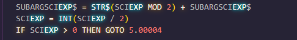

# Telebasic
Syntax highlighting for Telebasic in VSCode, Updated for basic.man 2022. All of the unincorporated stuff: `defdbl`, `defint`, `defsng`, etc are not included, if Telebasic updates for this then I will include it (lazy).

## Uses [Tandy Color Basic](https://marketplace.visualstudio.com/items?itemName=Tandy.color-basic) syntax highlighter

 It is the current syntax highlighter I've been using, and wanted to incorporate the TH stuff.
Now you know why my code is in all caps, and written traditionally `PRINT` instead of `?` and whatnot. I'm sure that if the regex stuff is in lowercase it'll highlight it as well, %untested%.

- Majority of the [Tandy Color Basic](https://marketplace.visualstudio.com/items?itemName=Tandy.color-basic) highlighting has been removed in favor of Telebasic. Some things still remain.

## Known issues
In the regex stuff, Lines `59` and `65`, if you use a variable name that is a function within the BASIC language it'll highlight it within. I've avoided doing eg. `\sEXP\s`, `\WEXP\s` or any other variation just out of simplicity, since everyones writing style is different.

AFAIK `TH_RE` and `TH_RE$` can't coexist, I've tried different things, I suck at regex. Its tough to incorporate (at least for me), since it's just one big OR statement. There was one solution of `TH\_RE\W` but it highlighted the starting open bracket `(` when using `TH_RE` and I didn't like it so I've left it at `TH_RE$` for the highlighting.

If you want to fix it you're more than welcome to make a pull request or whatever.

## How do I?
Download and install [Tandy Color Basic](https://marketplace.visualstudio.com/items?itemName=Tandy.color-basic) from the VSCode marketplace.

Copy `color-basic.tmLanguage` to the extentions folder `syntaxes`:
- Windows: `%USERPROFILE%\.vscode\extensions\tandy.color-basic-0.1.4\syntaxes`
- Linux: `~/.vscode/extensions/tandy.color-basic-0.1.4/syntaxes`
- Darwin: `~/.vscode/extensions/tandy.color-basic-0.1.4/syntaxes`

You can make a backup of the current file by making it `color-basic.tmLanguage.bakup` as an example, if you so wish to do so.

## Disclaimer
As of 5/8/2022 [Tandy Color Basic](https://marketplace.visualstudio.com/items?itemName=Tandy.color-basic) is version 0.1.4, and is subject to change if the developer updates it in anyway, You really only need lines `23`, `59`, `65`, and `71` (small change, did the line numbers from a length cap of 1-4 to 1-5 digits, personal preference) for future reference, just change those lines in the updated version with the corresponding lines in the `color-basic.tmLanguage` file to avoid any conficts with the updated Tandy BASIC syntax highlighting. I doubt you'll need to.

###### The Theme I use and in my screenshots is the [SynthWave '84](https://marketplace.visualstudio.com/items?itemName=RobbOwen.synthwave-vscode) theme, very pretty :sunglasses:
